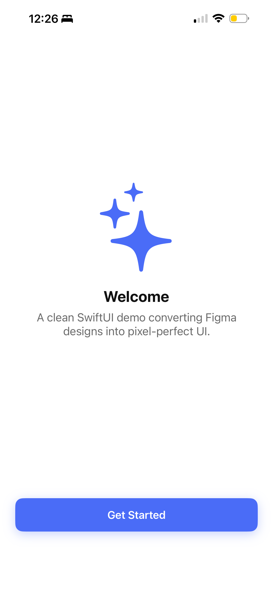
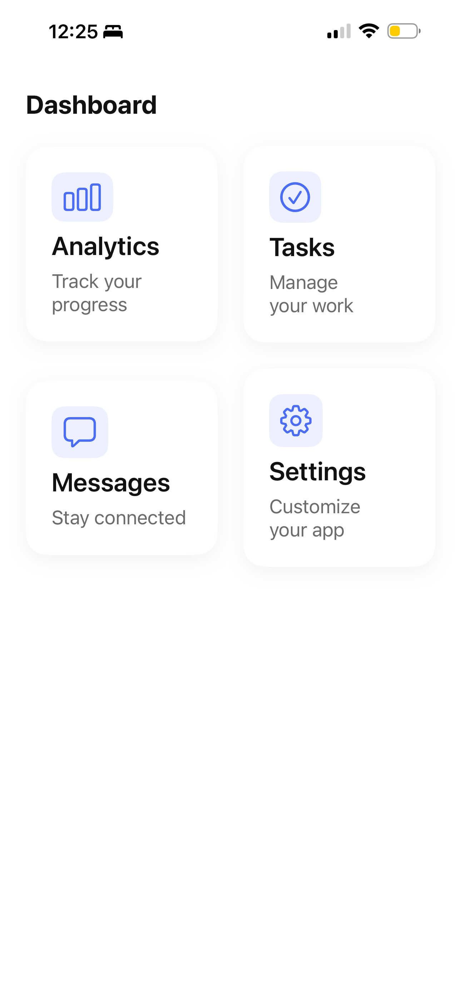
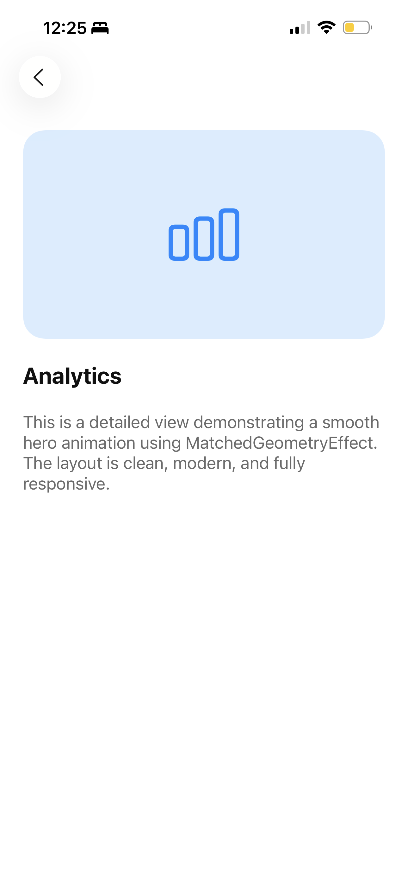

# SwiftUIPixcelPerfectDemo
A clean SwiftUI demo pixel‑perfect UI design and MVVM architecture with combine.

A clean, production‑quality SwiftUI demo that has pixel‑accurate iOS screens.  
This project showcases modern SwiftUI architecture, reusable components, smooth animations, and a scalable design system.

---

## 🧩 Why This Demo Exists

This project demonstrates:

- Ability to convert Figma designs into real SwiftUI UI  
- Clean, maintainable architecture  
- Modern SwiftUI animations  
- Reusable components and design tokens  
- Professional code quality for client projects  

Perfect for showcasing SwiftUI expertise to clients and teams.

---

## 📬 Contact

If you'd like help building a production‑ready SwiftUI/Swift app, camera pipeline, ARKit feature, or ML‑powered iOS tool, feel free to reach out.

Name : Raj Tapade
Email : raj.tapade111@gmail.com
Mobile : +917517599000 

---

## 📱 Overview

This demo includes:

- Pixel‑perfect Figma → SwiftUI implementation  
- Clean MVVM architecture  
- Reusable UI components (buttons, cards, layouts)  
- Smooth transitions & hero animations  
- Light/Dark mode support  
- A scalable theme system (colors, typography, spacing)  
- Navigation using `NavigationStack`  
- Modern SwiftUI patterns (LazyVGrid, MatchedGeometryEffect)

---

## 🖼 Screens

### **Onboarding Screen**
- Animated illustration  
- Title + subtitle  
- Reusable primary button  
- Smooth fade/slide‑in animations  

### **Home Dashboard**
- Responsive grid layout  
- Reusable card component  
- Spring animations on tap  
- Clean, modern dashboard UI  

### **Detail Screen**
- Hero animation using `MatchedGeometryEffect`  
- Large header with icon  
- Smooth content reveal animation  
- Back navigation with custom styling  

---

## 📸 Screenshots

### Onboarding

### Home Dashboard

### Detail Screen

## 🧱 Architecture

The project follows a clean and scalable structure

### **Why MVVM?**
- Clear separation of UI + logic  
- Easy to scale  
- Testable  
- Matches modern SwiftUI best practices  

---

## 🎨 Design System

The app uses a custom theme layer:

- **Colors** (from Asset Catalog)  
- **Typography** (scalable font tokens)  
- **Spacing** (consistent layout spacing)  

This ensures pixel‑perfect consistency across all screens.

---

## 🚀 Getting Started

1. Clone the repository  
2. Open the `.xcodeproj` in Xcode  
3. Run on iOS 17+  
4. Explore the screens and components  

No external dependencies — pure SwiftUI.

---

